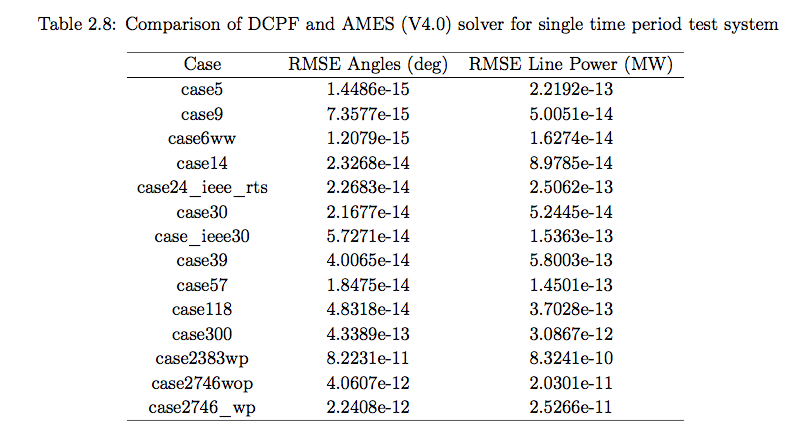

Validation and Examples
=======================

This is a comparison of MATPOWER and PSST solver results [open_kdheepak].

.. toctree::
   :maxdepth: 2

   ../notebooks/validation_notebooks_index

.. [open_kdheepak] Open Source Test Bed and Test Case Development for Power System Research, Dheepak Krishnamurthy
